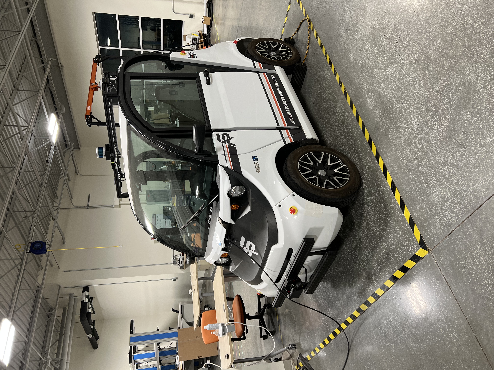

# Autonomous Vehicles

The repo contains the coursework done as part of [CS 588: Autonomous Vehicle Systems Engineering](http://luthuli.cs.uiuc.edu/~daf/courses/MAAV-22/588-2022-home.html) course, taught by [Prof. David Forsyth](http://luthuli.cs.uiuc.edu/~daf/) at UIUC.

The details of individual machine problems and our project can be found in their respective directories.

* [MP 1](mp1): Flashing Distress

* [MP 2](mp2): Brake on Detecting Pedestrian

* [MP 3](mp3): Simultaneous Localisation and Mapping (SLAM)

* [MP 4](mp4): GPS Scribbling

* [Project](project): Smart Summon

## Experimental Setup

All the experiments were done on the vehicle platform by [AutonomousStuff](https://autonomoustuff.com/).

## Team Members

Our sincere thanks to our instructor, Prof. David Forsyth, and the entire team.
* Akash Mittal
* Tony Joo
* Akul Joshi
* Samarth Aggarwal