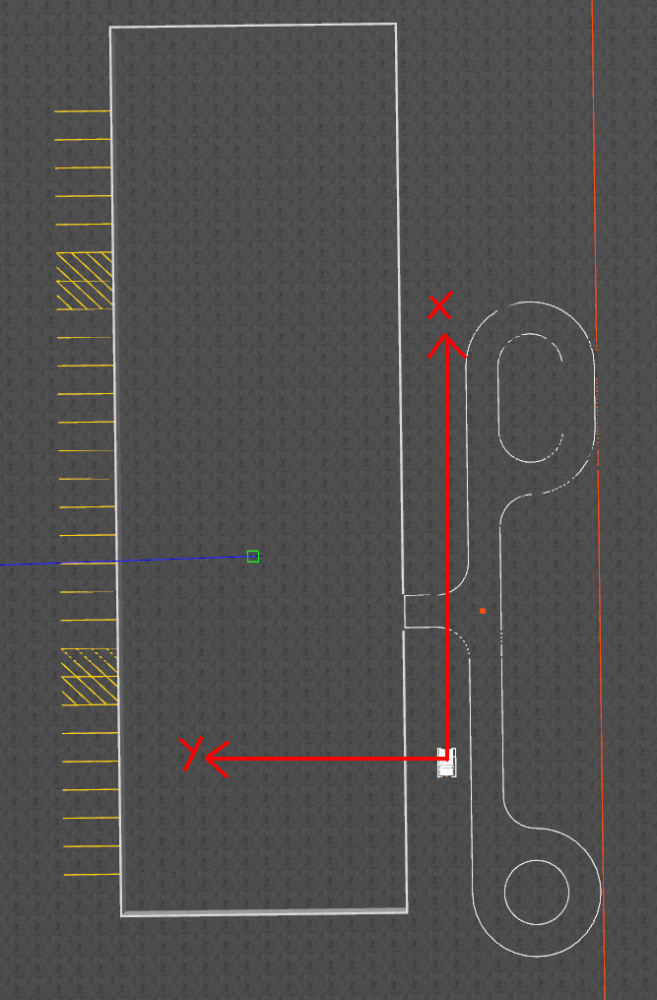

# Project: Smart Summon

As part of the final course project, we program the ability to _smartly summon_ the vehicle.

The vehicle knows its current location (localisation using GPS). The user enters destination coordinates. In the real world scenario, users can tell their current location to the parked car via smartphone application. The car then goes from source (current location) to destination and avoids any obstacle on the way.

## Test Instructions
- Specify the destination coordinates [here](https://github.com/samarthaggarwal/autonomous-vehicles/blob/main/project/config.py#L1). Note that the destination coordinates are specified in metric coordinate system with origin as the taped box on highbay.


- Specify the testing mode [here](https://github.com/samarthaggarwal/autonomous-vehicles/blob/main/project/lidar/config.py#L1) i.e. simulation mode or gem vehicle mode

Run the following commands in separate terminals. Run `source devel/setup.bash` before running each of the following commands.

### Simulator Test
- `roslaunch gem_launch gem_init.launch world_name:="project.world" x:=-19.89 y:=-17.35`
- `roslaunch gem_launch gem_sensor_info.launch`
- cd `./project/lidar` and run `python3 detect_obstacles.py`
- `rosrun summon summon_sim.py`

### Gem Vehicle Test
- `roslaunch basic_launch gem_sensor_init.launch`
- `roslaunch basic_launch gem_dbw_joystick.launch`
- cd `./project/lidar` and run `python3 detect_obstacles.py`
- `rosrun summon summon_voronoi.py`
- `rosrun summon summon_vehicle.py`

### Voronoi Test
Generate a random grid of obstacles and see its voronoi diagram.

```python
python voronoi.py TestVoronoi.test_random
```

Run all tests

```python
python voronoi.py
```

The following code generates a grid of 100*100 pixels with randomly placed 0s (free space) and 1s (obstacles). It randomly generates a source and destination pixel location and then visualises the voronoi path to go from source to the destination.
```python
import cv2
import matplotlib.pyplot as plt
from voronoi import Voronoi
from generate import *

m,n = 100, 100
numOnes = 10
grid = generate_random_grid(m, n, numOnes)
voronoi = Voronoi(grid)
src = (random.randint(0, m-1), random.randint(0, n-1))
dest = (random.randint(0, m-1), random.randint(0, n-1))
print(f"{src} -> {dest}")
path = voronoi.path(src, dest)
print(path)
voronoi.visualise_path(path)
img = cv2.imread('path.png')
plt.imshow(img)
```

## Demo

### Simulator

#### Full Demo
[](https://youtu.be/i-lD2U4WHMg)

#### Lidar based map generation
[](https://youtu.be/RhOWXrxQTsM)

### GEM Vehicle

#### Smart Summon - Building the obstacle map with Lidar

[](https://youtu.be/RybiM3pVGuM)

#### Smart Summon with Obstacle Detection (Lidar) and Dynamic Path Planning (Voronoi) - Inside View

[](https://youtu.be/vb3W54FPeVw)


#### Smart Summon with Obstacle Detection (Lidar) and Dynamic Path Planning (Voronoi) - Outside View

[](https://youtu.be/TV2HIjJie4Y)

### Failures

#### Lidar failure on snowy day
[](https://youtu.be/8132gOTaBkk)